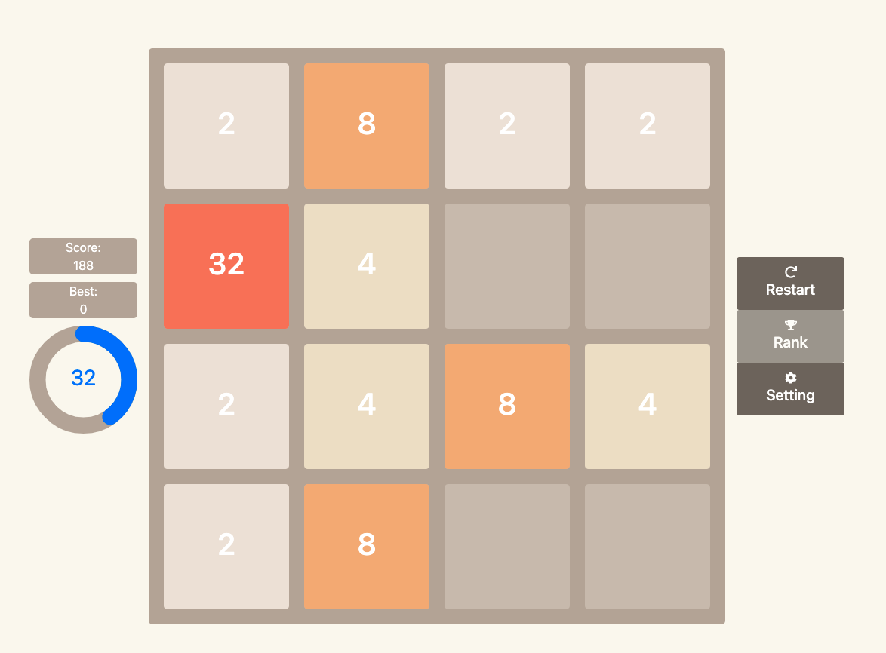

# React 2048

## 演示

[實際遊玩](https://react-2048-phi.vercel.app/)

## 概述

該專案目的在於嘗試新語言與套件，在技術上有大大進步空間，以下是該專案預計使用的技術與套件。

- Typescript
- Sass(scss)
- NextJS
- Jest(暫未應用)
- Storybook(暫未應用)

## 待做項目

因應事前文件閱讀與大量嘗試，導致一些細節與套件應用還未完善

- 動畫react-transition-group
- 單元測試Jest
- 元件展示Storybook
